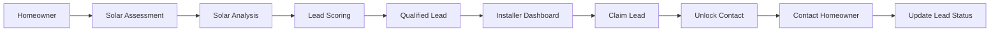

<div align="center">

# ☀️ SOLLAR INSTALLER

### Intelligent Solar Lead Generation & Installer Management Platform

**Discover • Qualify • Match • Connect • Track**

<br>

<a href="https://sunlead-usa.onrender.com/">
  
</a>
&nbsp;
<a href="https://github.com/jasminefloraa/Sollar_installer">
  
</a>

<br><br>


</div>

---

## ⚡ What is Sollar Installer?

**Sollar Installer** is a full-stack solar lead generation and installer management platform designed to connect **qualified homeowners with solar installers**.

Instead of simply passing raw leads to installers, the platform evaluates homeowner information, calculates solar potential, estimates savings, scores the lead, and makes qualified opportunities available through an installer dashboard.

> **The goal:** turn a homeowner's solar interest into an actionable, qualified installer opportunity.

---

## 🎯 The Problem

Traditional solar lead workflows often involve:

* Manual lead collection
* Unqualified prospects
* Slow lead distribution
* No centralized installer dashboard
* Limited lead visibility
* Manual follow-up
* Poor tracking of lead progress

### Sollar Installer solves this with one connected workflow:

<div align="center">

**Homeowner Assessment**

⬇

**Solar Potential Analysis**

⬇

**Lead Scoring**

⬇

**Installer Matching**

⬇

**Lead Claim**

⬇

**Contact Unlock**

⬇

**Status Tracking**

</div>

---

# ✨ Key Features

<table>
<tr>
<td width="50%">

### 🏠 Homeowner Assessment

Collect homeowner information and property details through a guided solar assessment flow.

</td>

<td width="50%">

### ☀️ Solar Estimation

Calculate estimated system size, annual savings, payback period and environmental impact.

</td>
</tr>

<tr>
<td>

### 📊 Intelligent Lead Scoring

Evaluate leads using property and solar-potential data and classify opportunities based on quality.

</td>

<td>

### 🔎 Installer Dashboard

Installers can browse qualified leads and view important opportunity information from one dashboard.

</td>
</tr>

<tr>
<td>

### 🔐 Claim & Contact Unlock

Installers can claim leads and unlock customer contact information through the workflow.

</td>

<td>

### 🔄 Lead Status Tracking

Track opportunities through different stages such as new, claimed, contacted and converted.

</td>
</tr>

<tr>
<td>

### ⚡ Real-Time Updates

Socket.IO enables real-time dashboard updates and notifications.

</td>

<td>

### 📈 Analytics

Monitor lead activity, installer performance and platform-level metrics.

</td>
</tr>
</table>

---

# 🧠 How It Works



---

# 🚀 Core Platform

<div align="center">

| Module              | Purpose                          |
| ------------------- | -------------------------------- |
| 🏠 Homeowner        | Submit solar requirements        |
| ☀️ Solar Engine     | Estimate solar potential         |
| 📊 Lead Engine      | Score and classify opportunities |
| 🏢 Installer Portal | Discover qualified leads         |
| 🔐 Authentication   | Secure role-based access         |
| 🔄 Real-Time Layer  | Live notifications and updates   |
| 📈 Analytics        | Platform and lead insights       |

</div>

---

# 🛠️ Technology Stack

### Backend


### Database


### Authentication


### Deployment


---

# 📐 System Architecture

```text
                         ┌──────────────────────┐
                         │      Homeowner       │
                         └──────────┬───────────┘
                                    │
                                    ▼
                         ┌──────────────────────┐
                         │ Solar Assessment API │
                         └──────────┬───────────┘
                                    │
                                    ▼
                         ┌──────────────────────┐
                         │  Solar Calculation   │
                         │    & Lead Scoring    │
                         └──────────┬───────────┘
                                    │
                                    ▼
                         ┌──────────────────────┐
                         │     Lead Database    │
                         └──────────┬───────────┘
                                    │
                                    ▼
                         ┌──────────────────────┐
                         │  Installer Dashboard │
                         └──────────┬───────────┘
                                    │
                      ┌─────────────┴─────────────┐
                      ▼                           ▼
               Claim Lead                 Lead Analytics
                      │
                      ▼
               Unlock Contact
                      │
                      ▼
               Update Status
```

---

# 🔑 Demo Accounts

### Installer

```text
Email:    demo@installer.com
Password: Installer@123
```

### Admin

```text
Email:    admin@sunlead.com
Password: Admin@123
```

> These credentials are provided for demonstration purposes only.

---

# 📊 Example Qualified Lead

```text
Lead ID              SL-2026-000002
Location             Dallas, TX 75001
Potential            High Potential
Lead Score           100
Estimated System     7.7 kW
Annual Savings       $2,160
Estimated Payback    7 years
CO₂ Reduction        4.2 t/year
```

---

# 🔌 API Highlights

| Method  | Endpoint                    | Purpose                        |
| ------- | --------------------------- | ------------------------------ |
| `POST`  | `/api/auth/login`           | Authenticate users             |
| `POST`  | `/api/homeowner/assessment` | Submit homeowner assessment    |
| `GET`   | `/api/leads`                | Retrieve available leads       |
| `PATCH` | `/api/leads/<id>`           | Update lead information        |
| `POST`  | `/api/leads/<id>/claim`     | Claim a lead                   |
| `POST`  | `/api/leads/<id>/assign`    | Assign lead to installer       |
| `GET`   | `/api/installers`           | Retrieve installer information |
| `GET`   | `/api/notifications`        | Retrieve notifications         |
| `GET`   | `/api/analytics`            | Retrieve analytics             |
| `GET`   | `/health`                   | Application health check       |

---

# 💻 Run Locally

### 1. Clone the repository

```bash
git clone https://github.com/jasminefloraa/Sollar_installer.git
cd Sollar_installer
```

### 2. Create a virtual environment

```bash
python -m venv venv
```

### 3. Activate it

**Windows**

```bash
venv\Scripts\activate
```

**macOS / Linux**

```bash
source venv/bin/activate
```

### 4. Install dependencies

```bash
pip install -r requirements.txt
```

### 5. Start the application

```bash
python app.py
```

### 6. Open the application

```text
http://127.0.0.1:5000
```

---

# ☁️ Deployment

The application is configured for deployment on **Render**.

### Build Command

```bash
pip install -r requirements.txt
```

### Start Command

```bash
gunicorn --threads 100 app:app
```

### Deployment Stack

```text
GitHub
   │
   ▼
Render
   │
   ▼
Gunicorn
   │
   ▼
Flask Application
   │
   ├── REST APIs
   ├── Socket.IO
   ├── Authentication
   ├── Lead Management
   └── Analytics
```

---

# 📁 Project Structure

```text
Sollar_installer/
│
├── app.py
├── requirements.txt
├── .gitignore
│
├── static/
│   └── index.html
│
└── instance/
    └── sunlead.db
```

> `instance/` is excluded from version control because it contains the local SQLite database.

---

# 🔐 Security & Engineering

The application includes:

* JWT-based authentication
* Role-based access
* Protected API endpoints
* CORS configuration
* Lead ownership and claim handling
* Contact information protection
* Server-side validation
* SQLite database persistence
* Real-time Socket.IO communication

---

# 🌱 Future Improvements

* PostgreSQL production database
* Advanced installer matching
* Email/SMS notifications
* Automated homeowner follow-ups
* Solar API integrations
* Installer subscription plans
* Advanced lead analytics
* CRM integrations
* Production-grade secret management
* Automated testing and CI/CD

---

# 📌 Project Status

<div align="center">

### 🟢 Core Application Complete

**Homeowner → Lead → Installer → Claim → Contact → Status**

<br>

**Deployment:** Render
**Repository:** GitHub
**Backend:** Flask
**Database:** SQLite
**Real-Time:** Socket.IO

</div>

---

# 👩‍💻 Developer

<div align="center">

### Jasmine Flora J

**B.Tech Computer Science & Engineering**

Aspiring Software Developer

<br>

<a href="https://github.com/jasminefloraa">
  
</a>

<a href="https://www.linkedin.com/in/jasmine-flora/">
  
</a>

</div>

---

<div align="center">

### ☀️ Turning Solar Interest Into Qualified Opportunities

**Sollar Installer — Discover. Qualify. Connect.**

</div>
